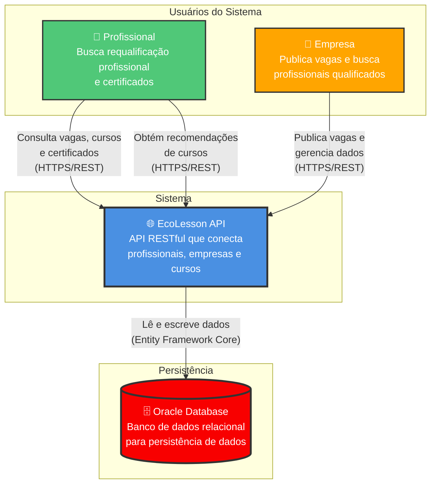
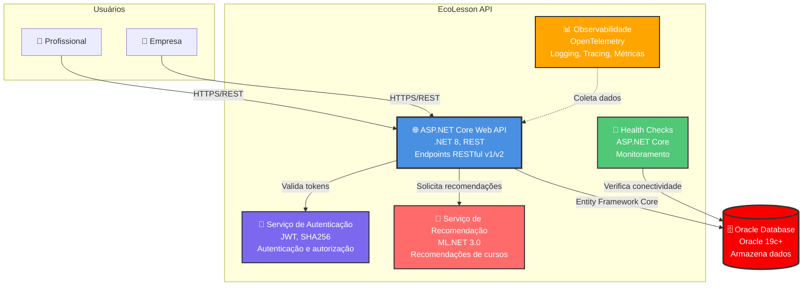
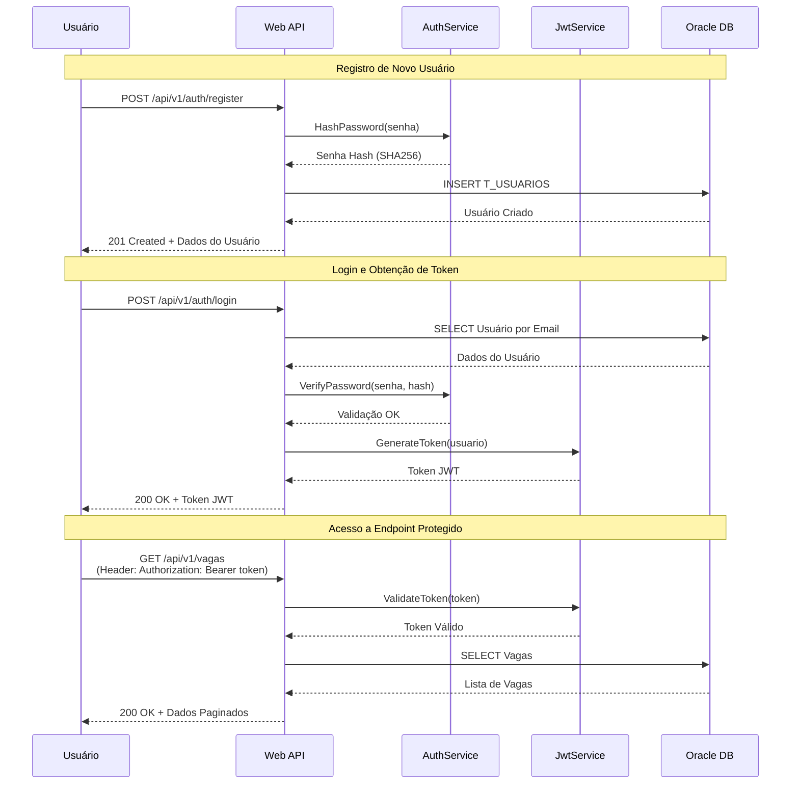
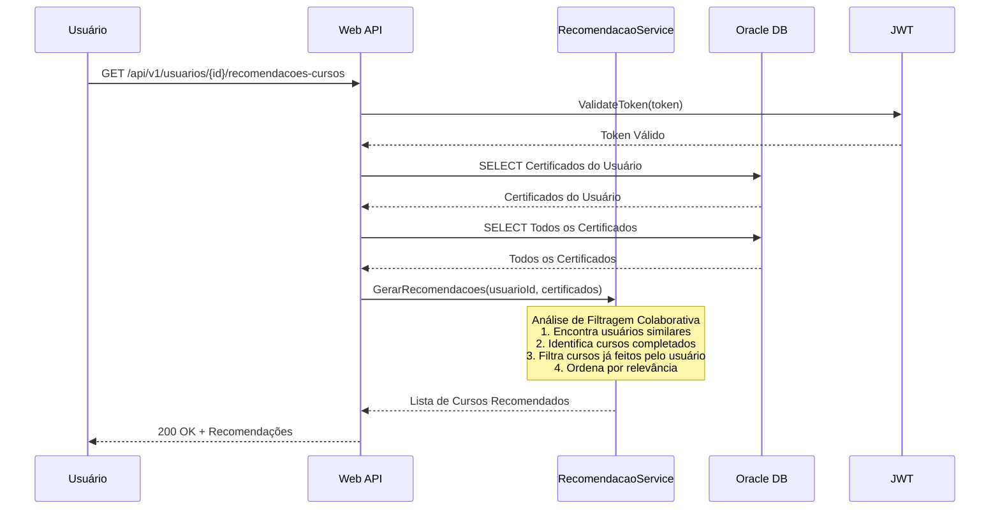
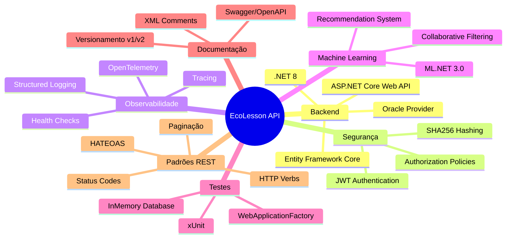

# EcoLesson API

## 📋 Sobre o Projeto

A **EcoLesson API** é uma API RESTful desenvolvida em .NET 8 que serve como a espinha dorsal de uma plataforma de requalificação profissional. A plataforma conecta profissionais que buscam se adaptar ao mercado, empresas que cadastram vagas e cursos educacionais para reskilling, visando diminuir a desigualdade e permitir que usuários façam cursos e adquiram certificados e se candidatem a vagas.

## Integrantes

Adriano Barutti Pessuto - RM556760
Vitor Kenzo Mizumoto - RM557245

---

## 🏗️ Arquitetura do Sistema

> **Nota sobre o Modelo C4**: Esta documentação utiliza o **Modelo C4** para descrever a arquitetura do sistema em diferentes níveis de abstração. O modelo C4 ajuda a visualizar a arquitetura de software de forma clara e compreensível, desde o contexto geral até os detalhes de implementação.

### Nível 1: Diagrama de Contexto (C4 Model)

O diagrama abaixo mostra o sistema EcoLesson API e suas interações com os usuários e sistemas externos.



### Nível 2: Diagrama de Contêineres (C4 Model)

O diagrama abaixo detalha os principais contêineres que compõem o sistema EcoLesson API.



### Componentes Principais

```mermaid
graph TB
    subgraph "Camada de Apresentação"
        A[Controllers]
        A1[AuthController]
        A2[UsuariosController]
        A3[EmpresasController]
        A4[VagasController]
        A5[CursosController]
        A6[CertificadosController]
        A7[RecomendacaoController]
        A8[VagasV2Controller]
        A9[EmpresasV2Controller]
    end
    
    subgraph "Camada de Serviços"
        B[Services]
        B1[JwtService]
        B2[PasswordService]
        B3[RecomendacaoService]
    end
    
    subgraph "Camada de Dados"
        C[Data Layer]
        C1[EcoLessonDbContext]
        C2[Entity Framework Core]
        C3[Migrations]
    end
    
    subgraph "Infraestrutura"
        D[Infrastructure]
        D1[Health Checks]
        D2[OpenTelemetry]
        D3[Logging]
        D4[Swagger/OpenAPI]
    end
    
    subgraph "Banco de Dados"
        E[(Oracle Database)]
        E1[T_USUARIOS]
        E2[T_EMPRESA]
        E3[T_VAGA]
        E4[T_CURSO]
        E5[T_CERTIFICADO]
    end
    
    A --> A1
    A --> A2
    A --> A3
    A --> A4
    A --> A5
    A --> A6
    A --> A7
    A --> A8
    A --> A9
    
    A1 --> B1
    A1 --> B2
    A7 --> B3
    A --> B
    
    B --> C
    C1 --> C2
    C2 --> C3
    C --> E
    
    A --> D4
    C --> D1
    A --> D2
    A --> D3
    
    C2 --> E1
    C2 --> E2
    C2 --> E3
    C2 --> E4
    C2 --> E5
    
    style A fill:#4A90E2,stroke:#333,stroke-width:2px,color:#fff
    style B fill:#7B68EE,stroke:#333,stroke-width:2px,color:#fff
    style C fill:#50C878,stroke:#333,stroke-width:2px,color:#fff
    style D fill:#FFA500,stroke:#333,stroke-width:2px,color:#fff
    style E fill:#F80000,stroke:#333,stroke-width:2px,color:#fff
```



### Fluxo de Autenticação e Autorização



### Fluxo de Recomendação ML.NET



### Tecnologias e Padrões Arquiteturais



### Descrição da Arquitetura

A arquitetura do EcoLesson API segue o **Modelo C4** (Context, Containers, Components, Code) e implementa uma arquitetura em camadas com separação de responsabilidades:

#### **Camadas da Aplicação:**

1. **Camada de Apresentação (Controllers)**
   - Responsável por receber requisições HTTP e retornar respostas
   - Implementa versionamento (v1 e v2)
   - Validação de entrada e tratamento de erros
   - Aplicação de HATEOAS nas respostas

2. **Camada de Serviços (Services)**
   - Lógica de negócio isolada
   - `JwtService`: Geração e validação de tokens JWT
   - `PasswordService`: Hash e verificação de senhas (SHA256)
   - `RecomendacaoService`: Algoritmos de ML para recomendações

3. **Camada de Dados (Data Layer)**
   - `EcoLessonDbContext`: Contexto do Entity Framework Core
   - Mapeamento de entidades para tabelas Oracle via Fluent API
   - Gerenciamento de migrations

4. **Camada de Infraestrutura**
   - Health Checks para monitoramento
   - OpenTelemetry para observabilidade
   - Logging estruturado
   - Swagger/OpenAPI para documentação

#### **Padrões Arquiteturais Aplicados:**

- **Repository Pattern**: Entity Framework Core atua como repositório
- **Dependency Injection**: Injeção de dependências nativa do ASP.NET Core
- **Service Layer Pattern**: Separação de lógica de negócio dos controllers
- **DTO Pattern**: Objetos de transferência de dados para isolamento
- **RESTful Architecture**: Endpoints seguindo princípios REST
- **API Versioning**: Controle de versões via URL (`/api/v1/`, `/api/v2/`)

#### **Decisões de Design:**

1. **Oracle Database**: Escolhido para atender requisitos do projeto
2. **JWT Authentication**: Autenticação stateless e escalável
3. **ML.NET**: Framework nativo .NET para machine learning
4. **OpenTelemetry**: Padrão aberto para observabilidade
5. **Health Checks**: Monitoramento nativo do ASP.NET Core
6. **Versionamento**: Permite evolução da API sem quebrar clientes existentes

---

## 🚀 Como Usar a API

### 1. Iniciar a API

```bash
cd EcoLessonAPI
dotnet run
```

A API estará disponível em:
- **HTTP**: `http://localhost:5030` (ou porta configurada)
- **Swagger UI**: `http://localhost:5030` (raiz do projeto)

### 2. Acessar o Swagger

Abra seu navegador e acesse: `http://localhost:5030`

O Swagger fornece uma interface interativa para testar todos os endpoints da API.

### 3. Fluxo de Uso Completo

#### Passo 1: Registrar um Usuário

**Endpoint:** `POST /api/v1/auth/register`

**No Swagger:**
1. Expanda o endpoint `POST /api/v1/Auth/register`
2. Clique em "Try it out"
3. Cole o JSON abaixo no campo "Request body":
```json
{
  "nome": "João Silva",
  "emailUsuario": "joao@email.com",
  "senha": "senha123",
  "cpf": "12345678900"
}
```
4. Clique em "Execute"
5. Você receberá um **201 Created** com os dados do usuário criado

**Com cURL:**
```bash
curl -X POST "http://localhost:5030/api/v1/auth/register" \
  -H "Content-Type: application/json" \
  -d '{
    "nome": "João Silva",
    "emailUsuario": "joao@email.com",
    "senha": "senha123",
    "cpf": "12345678900"
  }'
```

#### Passo 2: Fazer Login e Obter Token JWT

**Endpoint:** `POST /api/v1/auth/login`

**No Swagger:**
1. Expanda o endpoint `POST /api/v1/Auth/login`
2. Clique em "Try it out"
3. Cole o JSON abaixo:
```json
{
  "emailUsuario": "joao@email.com",
  "senha": "senha123"
}
```
4. Clique em "Execute"
5. **Copie o token** retornado no campo `token`

**Resposta esperada:**
```json
{
  "token": "eyJhbGciOiJIUzI1NiIsInR5cCI6IkpXVCJ9...",
  "expiresAt": "2025-11-10T22:00:00Z"
}
```

**Com cURL:**
```bash
curl -X POST "http://localhost:5030/api/v1/auth/login" \
  -H "Content-Type: application/json" \
  -d '{
    "emailUsuario": "joao@email.com",
    "senha": "senha123"
  }'
```

#### Passo 3: Autenticar no Swagger

1. No topo da página do Swagger, clique no botão **"Authorize"** 🔒
2. No campo "Value", cole o token JWT obtido no login
3. Clique em "Authorize" e depois em "Close"
4. Agora você pode acessar todos os endpoints protegidos!

#### Passo 4: Usar os Endpoints Protegidos

Agora que está autenticado, você pode:

**Criar uma Empresa:**
```json
POST /api/v1/empresas
{
  "razaoSocial": "Tech Solutions LTDA",
  "cnpj": "12345678000190",
  "emailEmpresa": "contato@techsolutions.com"
}
```

**Criar um Curso:**
```json
POST /api/v1/cursos
{
  "nomeCurso": "Desenvolvimento .NET Avançado",
  "descricao": "Curso completo de .NET 8 e APIs RESTful",
  "qtHoras": 40
}
```

**Criar uma Vaga:**
```json
POST /api/v1/vagas
{
  "nomeVaga": "Desenvolvedor .NET Pleno",
  "descricaoVaga": "Vaga para desenvolvedor .NET com experiência em APIs REST",
  "salario": 8000.00,
  "idEmpresa": 1
}
```

**Criar um Certificado:**
```json
POST /api/v1/certificados
{
  "idCertificado": "CERT-001",
  "dtEmissao": "2025-11-10",
  "descricao": "Certificado de conclusão do curso .NET",
  "codigoValidacao": "ABC123XYZ",
  "idUsuario": 1,
  "idCurso": 1
}
```

**Obter Recomendações de Cursos (ML.NET):**
```
GET /api/v1/usuarios/1/recomendacoes-cursos?topN=5
```

### 4. Exemplos com cURL (Autenticado)

**Listar Vagas:**
```bash
curl -X GET "http://localhost:5030/api/v1/vagas?page=1&pageSize=10" \
  -H "Authorization: Bearer SEU_TOKEN_AQUI"
```

**Criar Vaga:**
```bash
curl -X POST "http://localhost:5030/api/v1/vagas" \
  -H "Authorization: Bearer SEU_TOKEN_AQUI" \
  -H "Content-Type: application/json" \
  -d '{
    "nomeVaga": "Desenvolvedor .NET",
    "descricaoVaga": "Vaga para desenvolvedor .NET",
    "salario": 8000.00,
    "idEmpresa": 1
  }'
```

**Obter Recomendações:**
```bash
curl -X GET "http://localhost:5030/api/v1/usuarios/1/recomendacoes-cursos?topN=5" \
  -H "Authorization: Bearer SEU_TOKEN_AQUI"
```

## 📚 Documentação Completa dos Endpoints

### 🔐 Autenticação (Públicos)

#### `POST /api/v1/auth/register`
Registra um novo usuário na plataforma.

**Request:**
```json
{
  "nome": "string (obrigatório)",
  "emailUsuario": "string (obrigatório, único)",
  "senha": "string (obrigatório)",
  "cpf": "string (obrigatório, único)"
}
```

**Response:** `201 Created`
```json
{
  "idUsuario": 1,
  "nome": "João Silva",
  "emailUsuario": "joao@email.com",
  "cadastro": "2025-11-10T21:00:00",
  "cpf": "12345678900",
  "links": [
    {
      "href": "/api/v1/usuarios/1",
      "rel": "self",
      "method": "GET"
    }
  ]
}
```

#### `POST /api/v1/auth/login`
Autentica um usuário e retorna token JWT.

**Request:**
```json
{
  "emailUsuario": "string (obrigatório)",
  "senha": "string (obrigatório)"
}
```

**Response:** `200 OK`
```json
{
  "token": "eyJhbGciOiJIUzI1NiIsInR5cCI6IkpXVCJ9...",
  "expiresAt": "2025-11-10T22:00:00Z"
}
```

**Erros:**
- `400 Bad Request`: Dados inválidos
- `401 Unauthorized`: Email ou senha incorretos

---

### 👥 Usuários (Protegidos - Requer JWT)

#### `GET /api/v1/usuarios`
Lista todos os usuários com paginação.

**Query Parameters:**
- `page` (opcional): Número da página (padrão: 1)
- `pageSize` (opcional): Itens por página (padrão: 10, máximo: 100)

**Exemplo:**
```
GET /api/v1/usuarios?page=1&pageSize=20
```

**Response:** `200 OK`
```json
{
  "data": [
    {
      "idUsuario": 1,
      "nome": "João Silva",
      "emailUsuario": "joao@email.com",
      "cadastro": "2025-11-10T21:00:00",
      "cpf": "12345678900"
    }
  ],
  "page": 1,
  "pageSize": 20,
  "totalCount": 1,
  "totalPages": 1,
  "hasPreviousPage": false,
  "hasNextPage": false
}
```

#### `GET /api/v1/usuarios/{id}`
Obtém um usuário específico.

**Response:** `200 OK` com dados do usuário e links HATEOAS

#### `POST /api/v1/usuarios`
Cria um novo usuário.

**Request:**
```json
{
  "nome": "string",
  "emailUsuario": "string (único)",
  "senha": "string",
  "cpf": "string (único)"
}
```

#### `PUT /api/v1/usuarios/{id}`
Atualiza um usuário existente.

#### `DELETE /api/v1/usuarios/{id}`
Remove um usuário.

---

### 🏢 Empresas (Protegidos - Requer JWT)

#### `GET /api/v1/empresas`
Lista empresas com paginação.

#### `GET /api/v1/empresas/{id}`
Obtém uma empresa específica.

#### `POST /api/v1/empresas`
Cria uma nova empresa.

**Request:**
```json
{
  "razaoSocial": "string (obrigatório)",
  "cnpj": "string (obrigatório, único)",
  "emailEmpresa": "string (obrigatório)"
}
```

#### `PUT /api/v1/empresas/{id}`
Atualiza uma empresa.

#### `DELETE /api/v1/empresas/{id}`
Remove uma empresa.

---

### 💼 Vagas (Protegidos - Requer JWT)

#### `GET /api/v1/vagas`
Lista vagas com paginação e filtro opcional por empresa.

**Query Parameters:**
- `page` (opcional): Número da página
- `pageSize` (opcional): Itens por página
- `empresaId` (opcional): Filtrar por ID da empresa

**Exemplo:**
```
GET /api/v1/vagas?page=1&pageSize=10&empresaId=1
```

#### `GET /api/v1/vagas/{id}`
Obtém uma vaga específica com links HATEOAS.

#### `POST /api/v1/vagas`
Cria uma nova vaga.

**Request:**
```json
{
  "nomeVaga": "string (obrigatório)",
  "descricaoVaga": "string (obrigatório)",
  "salario": 0.00 (obrigatório, decimal),
  "idEmpresa": 0 (obrigatório, decimal)
}
```

#### `PUT /api/v1/vagas/{id}`
Atualiza uma vaga.

#### `DELETE /api/v1/vagas/{id}`
Remove uma vaga.

---

### 📚 Cursos (Protegidos - Requer JWT)

#### `GET /api/v1/cursos`
Lista cursos com paginação.

#### `GET /api/v1/cursos/{id}`
Obtém um curso específico.

#### `POST /api/v1/cursos`
Cria um novo curso.

**Request:**
```json
{
  "nomeCurso": "string (obrigatório)",
  "descricao": "string (obrigatório)",
  "qtHoras": 0 (obrigatório, decimal)
}
```

#### `PUT /api/v1/cursos/{id}`
Atualiza um curso.

#### `DELETE /api/v1/cursos/{id}`
Remove um curso.

---

### 🎓 Certificados (Protegidos - Requer JWT)

#### `GET /api/v1/certificados`
Lista certificados com paginação.

#### `GET /api/v1/certificados/{id}`
Obtém um certificado específico.

#### `POST /api/v1/certificados`
Cria um novo certificado.

**Request:**
```json
{
  "idCertificado": "string (obrigatório, único)",
  "dtEmissao": "2025-11-10 (obrigatório, formato: YYYY-MM-DD)",
  "descricao": "string (obrigatório)",
  "codigoValidacao": "string (obrigatório)",
  "idUsuario": 0 (obrigatório, decimal),
  "idCurso": 0 (obrigatório, decimal)
}
```

#### `PUT /api/v1/certificados/{id}`
Atualiza um certificado.

#### `DELETE /api/v1/certificados/{id}`
Remove um certificado.

---

### 🤖 Recomendações ML.NET (Protegidos - Requer JWT)

#### `GET /api/v1/usuarios/{id}/recomendacoes-cursos`
Obtém recomendações de cursos para um usuário usando ML.NET.

**Query Parameters:**
- `topN` (opcional): Número de recomendações (padrão: 5, máximo: 20)

**Exemplo:**
```
GET /api/v1/usuarios/1/recomendacoes-cursos?topN=10
```

**Response:** `200 OK`
```json
[
  {
    "idCurso": 2,
    "nomeCurso": "Curso Recomendado",
    "descricao": "Descrição do curso",
    "qtHoras": 40
  }
]
```

**Como funciona:**
O sistema analisa os certificados existentes (quem fez qual curso) e usa algoritmos de filtragem colaborativa para sugerir cursos que usuários similares completaram.

---

## 🔒 Autenticação JWT

### Como Obter o Token

1. Faça login em `POST /api/v1/auth/login`
2. Copie o token retornado no campo `token`
3. Use o token no header `Authorization`

### Como Usar o Token

**No Swagger:**
1. Clique no botão "Authorize" no topo da página
2. Cole o token no campo "Value"
3. Clique em "Authorize"

**Com cURL:**
```bash
-H "Authorization: Bearer SEU_TOKEN_AQUI"
```

**Com JavaScript/Fetch:**
```javascript
fetch('http://localhost:5030/api/v1/vagas', {
  headers: {
    'Authorization': 'Bearer SEU_TOKEN_AQUI',
    'Content-Type': 'application/json'
  }
})
```

**Com Postman:**
1. Vá em "Authorization"
2. Selecione "Bearer Token"
3. Cole o token

### Validade do Token

O token expira em **60 minutos** (configurável em `appsettings.json`). Após expirar, faça login novamente.

---

## 🏥 Health Checks

A API fornece endpoints de health check para monitoramento:

### `/healthz` - Liveness Probe
Verifica se a aplicação está viva e respondendo.

**Exemplo de resposta:**
```json
{
  "status": "Healthy",
  "timestamp": "2025-11-10T20:00:00Z",
  "checks": [
    {
      "name": "oracle-db",
      "status": "Healthy",
      "description": "Entity Framework Core DbContext health check",
      "duration": 15.5
    }
  ]
}
```

### `/readyz` - Readiness Probe
Verifica se a aplicação está pronta para receber requisições, incluindo verificação de conexão com o banco de dados Oracle.

**Exemplo de resposta:**
```json
{
  "status": "Healthy",
  "timestamp": "2025-11-10T20:00:00Z",
  "checks": [
    {
      "name": "oracle-db",
      "status": "Healthy",
      "description": "Entity Framework Core DbContext health check",
      "duration": 15.5,
      "tags": ["oracle-db"]
    }
  ]
}
```

**Status possíveis:**
- `Healthy`: Tudo funcionando corretamente
- `Degraded`: Funcionando, mas com problemas menores
- `Unhealthy`: Não está funcionando corretamente

**Uso:**
```bash
# Verificar se a API está viva
curl http://localhost:5030/healthz

# Verificar se está pronta (incluindo banco)
curl http://localhost:5030/readyz
```

---

## 📊 Paginação

Todos os endpoints de listagem (`GET /api/v1/{recurso}`) suportam paginação:

**Query Parameters:**
- `page`: Número da página (padrão: 1, mínimo: 1)
- `pageSize`: Itens por página (padrão: 10, mínimo: 1, máximo: 100)

**Exemplo:**
```
GET /api/v1/vagas?page=2&pageSize=20
```

**Response:**
```json
{
  "data": [...],
  "page": 2,
  "pageSize": 20,
  "totalCount": 100,
  "totalPages": 5,
  "hasPreviousPage": true,
  "hasNextPage": true
}
```

---

## 🔗 HATEOAS (Hypermedia)

As respostas de `GET /{id}` e `POST` incluem links relacionados para facilitar a navegação:

**Exemplo de resposta com HATEOAS:**
```json
{
  "idVaga": 1,
  "nomeVaga": "Desenvolvedor .NET",
  "descricaoVaga": "...",
  "salario": 8000.00,
  "dtPublicacao": "2025-11-10",
  "idEmpresa": 1,
  "links": [
    {
      "href": "/api/v1/vagas/1",
      "rel": "self",
      "method": "GET"
    },
    {
      "href": "/api/v1/vagas/1",
      "rel": "update",
      "method": "PUT"
    },
    {
      "href": "/api/v1/vagas/1",
      "rel": "delete",
      "method": "DELETE"
    },
    {
      "href": "/api/v1/empresas/1",
      "rel": "empresa",
      "method": "GET"
    }
  ]
}
```

---

## 🏥 Health Checks

A API expõe dois endpoints de health check (não requerem autenticação):

### `GET /healthz`
**Liveness Probe** - Verifica se a aplicação está rodando.

**Response:** `200 OK`
```json
{
  "status": "Healthy"
}
```

### `GET /readyz`
**Readiness Probe** - Verifica se a aplicação está pronta (inclui verificação de conexão com o banco Oracle).

**Response:** `200 OK` se saudável, `503 Service Unavailable` se não estiver pronto.

---

## 📈 Status Codes HTTP

A API utiliza os seguintes status codes:

- **200 OK**: Requisição bem-sucedida
- **201 Created**: Recurso criado com sucesso
- **204 No Content**: Recurso removido com sucesso
- **400 Bad Request**: Dados inválidos ou validação falhou
- **401 Unauthorized**: Token JWT ausente ou inválido
- **404 Not Found**: Recurso não encontrado
- **500 Internal Server Error**: Erro interno do servidor

---

## 🛠️ Configuração

### String de Conexão Oracle

Edite `appsettings.json`:
```json
{
  "ConnectionStrings": {
    "DefaultConnection": "User Id=SEU_USUARIO;Password=SUA_SENHA;Data Source=oracle.fiap.com.br:1521/ORCL"
  }
}
```

### Configuração JWT

Edite `appsettings.json`:
```json
{
  "Jwt": {
    "Key": "SuaChaveSecretaComPeloMenos32Caracteres!",
    "Issuer": "EcoLessonAPI",
    "Audience": "EcoLessonAPI",
    "ExpiresInMinutes": "60"
  }
}
```

---

## 🏗️ Arquitetura

A API foi desenvolvida seguindo as melhores práticas de desenvolvimento .NET:

- **.NET 8**: Framework mais recente
- **Entity Framework Core**: ORM para acesso a dados
- **Oracle Database**: Banco de dados relacional
- **JWT Authentication**: Autenticação e autorização
- **ML.NET**: Sistema de recomendação de cursos
- **OpenTelemetry**: Observabilidade e monitoramento
- **xUnit**: Testes de integração

## 📦 Estrutura do Projeto

```
EcoLessonAPI/
├── Controllers/          # Controllers da API
│   ├── AuthController.cs
│   ├── UsuariosController.cs
│   ├── EmpresasController.cs
│   ├── VagasController.cs
│   ├── CursosController.cs
│   ├── CertificadosController.cs
│   └── RecomendacaoController.cs
├── Data/                # Camada de dados
│   └── EcoLessonDbContext.cs
├── DTOs/                # Data Transfer Objects
├── Models/              # Entidades do domínio
├── Services/            # Serviços de negócio
│   ├── PasswordService.cs
│   ├── JwtService.cs
│   └── RecomendacaoService.cs
└── Program.cs           # Configuração da aplicação

EcoLessonAPI.Tests/
└── VagasControllerTests.cs  # Testes de integração
```

## 🗄️ Modelo de Dados

### Entidades

- **T_USUARIOS**: Usuários da plataforma (profissionais)
- **T_EMPRESA**: Empresas cadastradas
- **T_VAGA**: Vagas de emprego
- **T_CURSO**: Cursos disponíveis
- **T_CERTIFICADO**: Certificados emitidos para usuários

## 🔐 Versionamento da API

**Esta API utiliza versionamento via URL. A versão estável atual é a `/api/v1/`.**

Todos os endpoints estão prefixados com `/api/v1/` para garantir compatibilidade futura e permitir evolução da API sem quebrar clientes existentes.

## 🚀 Como Executar

### Pré-requisitos

- .NET 8 SDK
- Oracle Database (ou acesso ao Oracle da FIAP)
- Visual Studio 2022 / VS Code / Rider

### Configuração

1. **Clone o repositório**
   ```bash
   git clone <repository-url>
   cd GS
   ```

2. **Configure a string de conexão**

   Edite o arquivo `appsettings.json`:
   ```json
   {
     "ConnectionStrings": {
       "DefaultConnection": "User Id=RM557245;Password=021005;Data Source=oracle.fiap.com.br:1521/ORCL"
     }
   }
   ```

3. **Execute as migrations** (se necessário)
   ```bash
   cd EcoLessonAPI
   dotnet ef database update
   ```

4. **Execute a aplicação**
   ```bash
   dotnet run
   ```

A API estará disponível em:
- **HTTP**: `http://localhost:5030` (ou porta configurada)
- **Swagger UI**: `http://localhost:5030` (raiz do projeto)

## 📈 Observabilidade

### Logging

A API utiliza `ILogger` para logging estruturado. Os logs são registrados em:
- Console
- Debug output
- OpenTelemetry

### OpenTelemetry

A API está instrumentada com OpenTelemetry para:
- **Tracing**: Rastreamento de requisições HTTP e operações do Entity Framework
- **Metrics**: Métricas de performance
- **Logs**: Logs estruturados

Os dados são exportados para o console (para demonstração). Em produção, configure exportadores para Jaeger, Prometheus, etc.

## 🧪 Testes

### Executar Testes

```bash
cd EcoLessonAPI.Tests
dotnet test
```

### Testes Implementados

Os testes de integração validam:

- ✅ `GET /api/v1/vagas` retorna 200 e uma lista paginada
- ✅ `POST /api/v1/vagas` com dados inválidos retorna 400
- ✅ `POST /api/v1/vagas` com dados válidos retorna 201
- ✅ `GET /api/v1/vagas/999` (ID inexistente) retorna 404

Os testes utilizam:
- **xUnit**: Framework de testes
- **WebApplicationFactory**: Hospeda a API em memória
- **InMemoryDatabase**: Isola os testes do banco de dados real

## 📋 Requisitos Implementados

### ✅ Requisitos Obrigatórios

#### Req 1: Boas Práticas REST (30 pts)
- ✅ Paginação em todos os endpoints de listagem (GET)
- ✅ HATEOAS em respostas de GET /{id} e POST
- ✅ Status Codes HTTP adequados (200, 201, 204, 400, 404)
- ✅ Verbos HTTP corretos (GET, POST, PUT, DELETE)

#### Req 2: Monitoramento e Observabilidade (15 pts)
- ✅ Health Check (`/healthz` e `/readyz`)
- ✅ Logging estruturado (ILogger)
- ✅ Tracing (OpenTelemetry)

#### Req 3: Versionamento da API (10 pts)
- ✅ Todas as rotas com prefixo `/api/v1/`
- ✅ README.md explicita o uso de versionamento v1

#### Req 4: Integração e Persistência (30 pts)
- ✅ Integração com Oracle Database
- ✅ Entity Framework Core com Migrations

#### Req 5: Testes Integrados (15 pts)
- ✅ Testes automatizados com xUnit
- ✅ WebApplicationFactory para hospedar API em memória
- ✅ InMemoryDatabase para isolar testes

### ✅ Requisitos Opcionais (100%)

#### Segurança: Autenticação JWT
- ✅ Endpoints `/api/v1/auth/register` e `/api/v1/auth/login`
- ✅ Hash de senhas (SHA256)
- ✅ Proteção de endpoints com `[Authorize]`
- ✅ Geração e validação de tokens JWT
- ✅ Configuração de ClockSkew para evitar problemas de sincronização

#### ML.NET: Sistema de Recomendação
- ✅ Endpoint `GET /api/v1/usuarios/{id}/recomendacoes-cursos`
- ✅ ML.NET com filtragem colaborativa
- ✅ Análise de certificados para sugerir cursos
- ✅ Parâmetro `topN` para controlar quantidade de recomendações

---

## 📊 Checklist Completo de Requisitos

### ✅ 1. Boas Práticas REST (30 pontos)

- ✅ **Paginação**: Implementada em todos os endpoints de listagem (GET)
  - Parâmetros: `page` (padrão: 1) e `pageSize` (padrão: 10, máximo: 100)
  - Resposta inclui: `data`, `page`, `pageSize`, `totalCount`, `totalPages`
- ✅ **HATEOAS**: Implementado em respostas GET /{id} e POST
  - Cada recurso retorna uma lista `links` com relacionamentos
  - Links incluem: `self`, `update`, `delete`, e links para recursos relacionados
- ✅ **Status Codes HTTP adequados**:
  - `200 OK`: Operações bem-sucedidas (GET, PUT)
  - `201 Created`: Criação bem-sucedida (POST)
  - `204 NoContent`: Deleção bem-sucedida (DELETE)
  - `400 BadRequest`: Validação falhou
  - `404 NotFound`: Recurso não encontrado
  - `401 Unauthorized`: Não autenticado
- ✅ **Verbos HTTP corretos**:
  - `GET`: Consulta de recursos
  - `POST`: Criação de recursos
  - `PUT`: Atualização de recursos
  - `DELETE`: Remoção de recursos

### ✅ 2. Monitoramento e Observabilidade (15 pontos)

- ✅ **Health Checks**:
  - `/healthz`: Liveness probe (verifica se a aplicação está viva)
  - `/readyz`: Readiness probe (verifica se está pronto, incluindo conexão com Oracle)
  - **Retorna informações detalhadas em JSON:**
    ```json
    {
      "status": "Healthy",
      "timestamp": "2025-11-10T20:00:00Z",
      "checks": [
        {
          "name": "oracle-db",
          "status": "Healthy",
          "description": "...",
          "duration": 15.5,
          "tags": ["oracle-db"]
        }
      ]
    }
    ```
- ✅ **Logging estruturado**:
  - Uso de `ILogger<T>` em todos os controllers
  - Logs de informações, avisos e erros
  - Integração com OpenTelemetry
- ✅ **Tracing com OpenTelemetry**:
  - Instrumentação do ASP.NET Core
  - Instrumentação do Entity Framework Core
  - Exportação para Console (para demonstração)
  - Métricas e rastreamento de requisições

### ✅ 3. Versionamento da API (10 pontos)

- ✅ **Estrutura de versões**:
  - `/api/v1/`: Versão 1 (estável)
  - `/api/v2/`: Versão 2 (melhorada)
- ✅ **Controle adequado em rotas**:
  - Cada versão tem seus próprios controllers
  - v2 mantém compatibilidade com v1 e adiciona funcionalidades
- ✅ **Explicitação no README**:
  - Seção dedicada ao versionamento
  - Exemplos de uso de cada versão
  - Documentação das diferenças entre versões

### ✅ 4. Integração e Persistência (30 pontos)

- ✅ **Integração com Oracle Database**:
  - String de conexão configurada em `appsettings.json`
  - Uso do provider `Oracle.EntityFrameworkCore`
  - Suporte a tipos Oracle (NUMBER, VARCHAR, CLOB, DATE)
- ✅ **Entity Framework Core**:
  - DbContext configurado (`EcoLessonDbContext`)
  - Fluent API para mapeamento de entidades para tabelas Oracle
  - Configuração de chaves primárias, índices únicos e relacionamentos
- ✅ **Migrations**:
  - Migrations criadas e aplicadas
  - Suporte a geração automática de IDs via Sequences e Triggers Oracle
  - Histórico de migrations gerenciado pelo EF Core

### ✅ 5. Testes Integrados (15 pontos)

- ✅ **Testes automatizados com xUnit**:
  - Projeto de testes: `EcoLessonAPI.Tests`
  - Uso de `WebApplicationFactory<Program>` para hospedar a API em memória
  - Isolamento usando `InMemoryDatabase` para testes
- ✅ **Testes implementados**:
  - `GET /api/v1/vagas` retorna 200 e lista paginada
  - `POST /api/v1/vagas` com dados válidos retorna 201
  - `POST /api/v1/vagas` com dados inválidos retorna 400
  - `GET /api/v1/vagas/999` (ID inexistente) retorna 404
- ✅ **Autenticação de teste**:
  - Handler customizado para testes (`TestAuthHandler`)
  - Bypass de autenticação JWT em ambiente de testes

### ✅ Requisitos Opcionais (Para 100%)

#### Segurança: Autenticação JWT
- ✅ Endpoints `/api/v1/auth/register` e `/api/v1/auth/login`
- ✅ Hash de senhas (SHA256)
- ✅ Proteção de endpoints com `[Authorize]`
- ✅ Geração e validação de tokens JWT
- ✅ Configuração de ClockSkew para evitar problemas de sincronização

#### ML.NET: Sistema de Recomendação
- ✅ Endpoint `GET /api/v1/usuarios/{id}/recomendacoes-cursos`
- ✅ ML.NET com filtragem colaborativa
- ✅ Análise de certificados para sugerir cursos
- ✅ Parâmetro `topN` para controlar quantidade de recomendações

## 🛠️ Tecnologias Utilizadas

- **.NET 8**
- **ASP.NET Core Web API**
- **Entity Framework Core 9.0**
- **Oracle.EntityFrameworkCore**
- **JWT Bearer Authentication**
- **ML.NET 3.0**
- **OpenTelemetry**
- **xUnit**
- **Swagger/OpenAPI**

## 📝 Notas de Desenvolvimento

### Migrations

Para criar uma nova migration:
```bash
dotnet ef migrations add NomeDaMigration --project EcoLessonAPI
```

Para aplicar migrations:
```bash
dotnet ef database update --project EcoLessonAPI
```

### Estrutura de Pastas

O projeto segue uma arquitetura em camadas:
- **Controllers**: Endpoints da API
- **Models**: Entidades do domínio
- **DTOs**: Objetos de transferência de dados
- **Data**: DbContext e configurações de banco
- **Services**: Lógica de negócio e serviços auxiliares

## 👥 Autores

**Vitor Kenzo Mizumoto** - RM557245  
**Adriano Barutti Pessuto** - RM556760

Desenvolvido para a disciplina **ADVANCED BUSINESS DEVELOPMENT WITH .NET** - FIAP Global Solution.

## 📄 Licença

Este projeto foi desenvolvido para fins acadêmicos.

---

**Versões da API:** v1 e v2  
**Última atualização:** 2025

---

## 📌 Versionamento da API

Esta API utiliza **versionamento via URL** para garantir compatibilidade e evolução controlada.

### Versões Disponíveis

#### **v1** - Versão Estável
- Endpoint base: `/api/v1/`
- Funcionalidades completas de CRUD
- Paginação e HATEOAS
- Autenticação JWT
- Recomendações ML.NET

#### **v2** - Versão Melhorada
- Endpoint base: `/api/v2/`
- Todas as funcionalidades da v1
- **Melhorias adicionais:**
  - **Vagas**: Filtro por salário mínimo e ordenação (nome, salário, data)
  - **Empresas**: Busca por nome/razão social
  - HATEOAS aprimorado com mais links relacionados

### Como Usar as Versões

**v1:**
```bash
GET /api/v1/vagas
GET /api/v1/empresas
```

**v2:**
```bash
GET /api/v2/vagas?salarioMin=5000&orderBy=salario
GET /api/v2/empresas?search=Tech
```

**Nota:** Os endpoints de autenticação (`/api/v1/auth/register` e `/api/v1/auth/login`) são compartilhados entre as versões.

### Swagger

No Swagger UI, você pode alternar entre as versões usando o seletor no topo da página:
- **EcoLesson API v1** - Documentação da versão 1
- **EcoLesson API v2** - Documentação da versão 2
